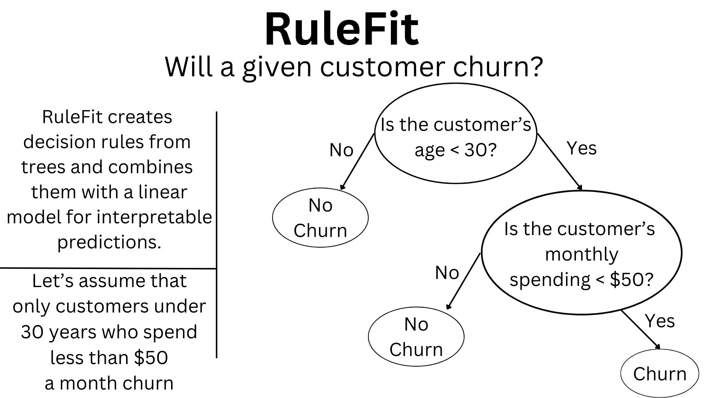
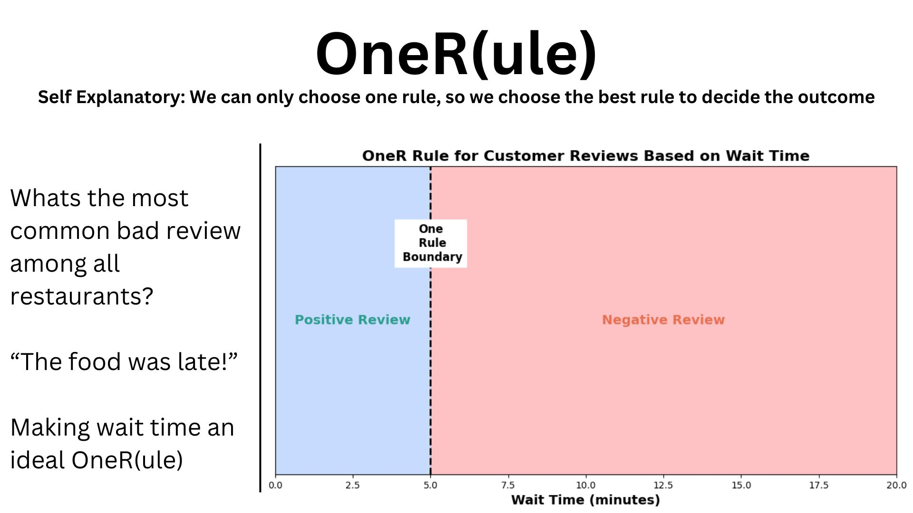
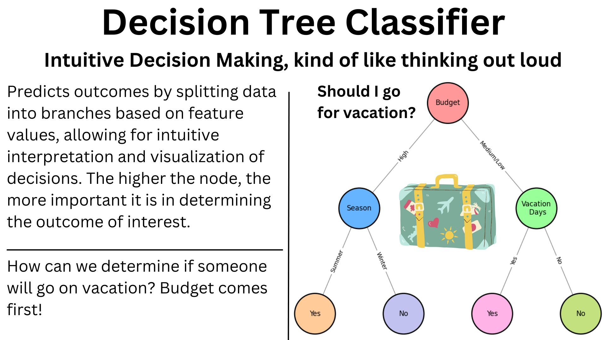

# Overview of Interpretable Models from the `imodels` Library

This repository provides an overview of three interpretable models available from the `imodels` library:

1. **OneR Classifier**
2. **RuleFit Classifier**
3. **Decision Tree Classifier**

## Contents

- **`interpretable ml II.ipynb`**: A Jupyter Notebook containing quick examples of predictions and interpretations using the three models.
- **Visual Demonstrations**: 
  - `RuleFit.jpg`
  - `OneR.jpg`
  - `DecisionTreeClassifier.jpg`

## Models Overview

### OneR Classifier

The OneR (One Rule) classifier is a simple and interpretable machine learning model that generates a single rule for classification. It evaluates each feature individually and selects the one that provides the best predictive accuracy. The chosen feature is then used to create a rule that maps its values to the target classes. Despite its simplicity, OneR can often produce surprisingly effective models, making it a useful baseline for comparison with more complex algorithms.

### RuleFit Classifier

The RuleFit classifier combines the predictive power of decision trees with the interpretability of linear models. It generates a set of rules from decision trees and then fits a sparse linear model using these rules as features. This approach allows for both high predictive accuracy and easy interpretation of the model's decisions.

### Decision Tree Classifier

The Decision Tree classifier is a widely used model that splits the data into subsets based on the value of input features. Each node in the tree represents a feature, and each branch represents a decision rule. The leaves of the tree represent the final classification. Decision trees are highly interpretable as they provide a clear and visual representation of the decision-making process.

## Visual Demonstrations

The repository includes visual demonstrations of the models' performance and interpretations:

### RuleFit Classifier


### OneR Classifier


### Decision Tree Classifier


These visualizations provide insights into how each model makes predictions and the importance of different features in the decision-making process.

## Usage

To explore the examples and visualizations, open the `interpretable ml II.ipynb` notebook. This notebook contains code and explanations for training and interpreting the three models using the `imodels` library.

## Requirements

- Python 3.x
- Jupyter Notebook
- `imodels` library
- `scikit-learn` library
- `matplotlib` library
- `pandas` library

Install the required libraries using pip:

```bash
pip install imodels scikit-learn matplotlib pandas
```